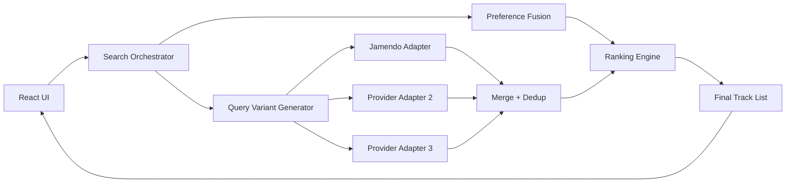
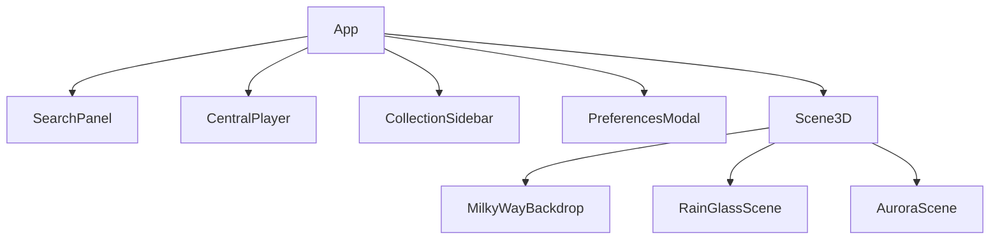
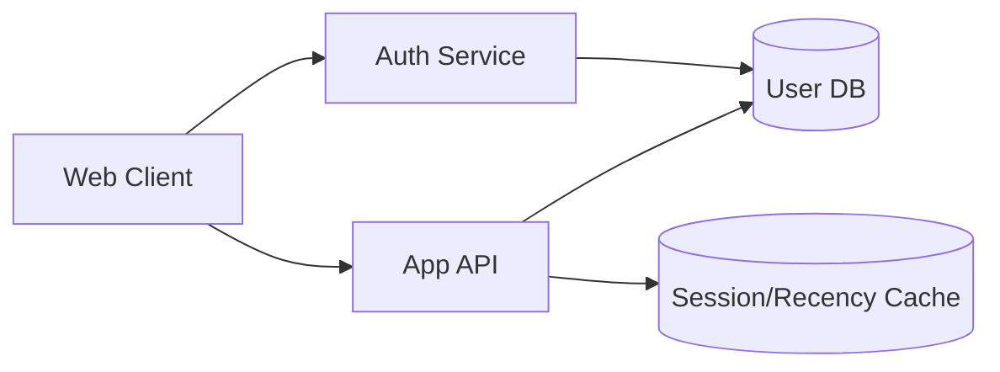

# Architecture and Delivery Plan

## TL;DR
- The project now needs explicit architecture governance to avoid complexity drift.
- This document defines current architecture, target architecture, and staged delivery for mobile + auth + data.

## 1) Current Architecture Snapshot

### 1.1 Frontend
- React + Vite + TypeScript
- Main orchestration in `App.tsx`
- Domain hooks:
  - `useSearch`
  - `usePlayer`
  - `useCollections`
  - `usePersistedState`
- Scene modules under `components/visualizer`

### 1.2 Service Layer
- AI analysis service (DeepSeek abstraction)
- tag mapping service
- Jamendo retrieval service
- local ranking and result processing

### 1.3 Data
- local storage for preferences/collections
- no multi-user auth/session yet

## 2) Target Architecture (near-term)

## 3) UI Architecture (high-level)

## 4) Data Architecture for User Accounts (target)

## 5) Mobile Adaptation Plan

1. Define viewport matrix:
   - 360x800
   - 390x844
   - 412x915
   - 768x1024
2. Theme-level checks:
   - no background offset
   - no overflow clipping
   - stable interaction layers (player/search/sidebar/modal)
3. Add fallback rules:
   - auto downgrade heavy effects for low resolution or low FPS.

## 6) Authentication and User Management Plan

### 6.1 MVP scope
1. invite-code onboarding (initial 5 seats),
2. user login/logout,
3. per-user preferences/favorites persistence,
4. admin view for user list/basic status.

### 6.2 Suggested implementation path
1. choose auth provider/package with minimal integration friction;
2. add backend user profile endpoints;
3. migrate local preferences/favorites to user-scoped storage;
4. preserve local fallback for guest mode if needed.

## 7) Delivery Order (from easiest module first)

1. Recommendation V2 retrieval/ranking modules.
2. Mobile rendering robustness fixes and QA baseline.
3. Auth + user storage integration.
4. Multi-provider production merge after adapter validation.

## 8) Decision Log (to maintain)

Track the following in future updates:
1. provider adoption decision and reason,
2. ranking weight changes,
3. mobile fallback thresholds,
4. auth policy (invite, quota, roles),
5. data migration strategy and rollback plan.

